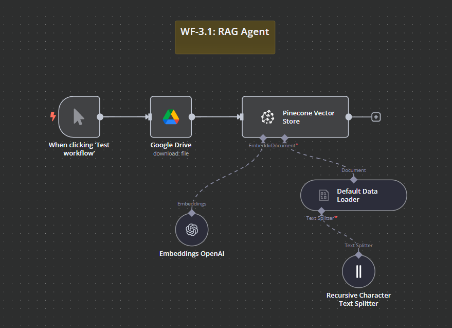
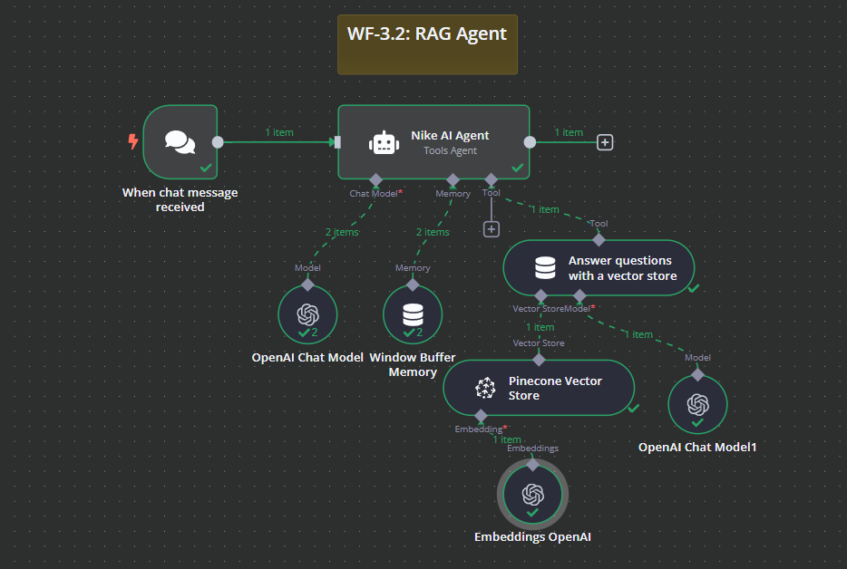

# WF-3.1 & WF-3.2: RAG Agent – n8n Workflow

## 📌 Overview
This **n8n workflow** consists of two interconnected parts:
- **`WF-3.1: RAG Agent`** embeds structured data into a **vector database**.
- **`WF-3.2: RAG Agent`** retrieves relevant data from the vector database to answer user queries.

The workflow leverages OpenAI for text embeddings, Pinecone for vector storage, and n8n automation to manage the process.

## 🔧 Workflow Components
### 🏗️ WF-3.1: Data Embedding
1. **📂 Google Drive** – Fetches source documents for processing.
2. **🧠 OpenAI Embeddings** – Converts text data into vector embeddings.
3. **📌 Pinecone Vector Store** – Stores embeddings for later retrieval.
4. **📝 Text Splitter** – Splits large text documents for efficient embedding.

### 🏗️ WF-3.2: Query Processing
1. **💬 Chat Trigger** – Listens for user queries.
2. **🤖 AI Agent** – Interprets queries and determines relevant data.
3. **📚 Vector Store Lookup** – Searches Pinecone for relevant stored embeddings.
4. **🧠 OpenAI Chat Model** – Constructs a response using retrieved data.

## ⚙️ How It Works
### 🔹 Data Embedding (WF-3.1)
1. 📄 A document is uploaded to **Google Drive**.
2. 📊 The **Text Splitter** processes and prepares data for embedding.
3. 🤖 The **OpenAI Embeddings** node converts text into vector format.
4. 📥 Data is stored in **Pinecone Vector Store**.

### 🔹 Query Processing (WF-3.2)
1. ❓ A user asks a question via chat.
2. 🔍 The **AI Agent** retrieves relevant information from Pinecone.
3. 🤖 OpenAI generates a human-like response.
4. 📤 The system returns an answer to the user.

## 📷 Workflow Screenshots
### WF-3.1: Data Embedding Workflow

### WF-3.2: Query Processing Workflow

## 🚀 Setup Instructions
- 📥 **Import the workflow** into `n8n`.
- 🔑 **Ensure API credentials** for OpenAI, Google Drive, and Pinecone are set up.
- ✅ **Activate the workflows** to start processing and answering queries.

## 📝 Notes
- ⚠️ The workflow is **inactive by default**.
- 🛠️ Modify the Pinecone namespace and data sources as needed.

